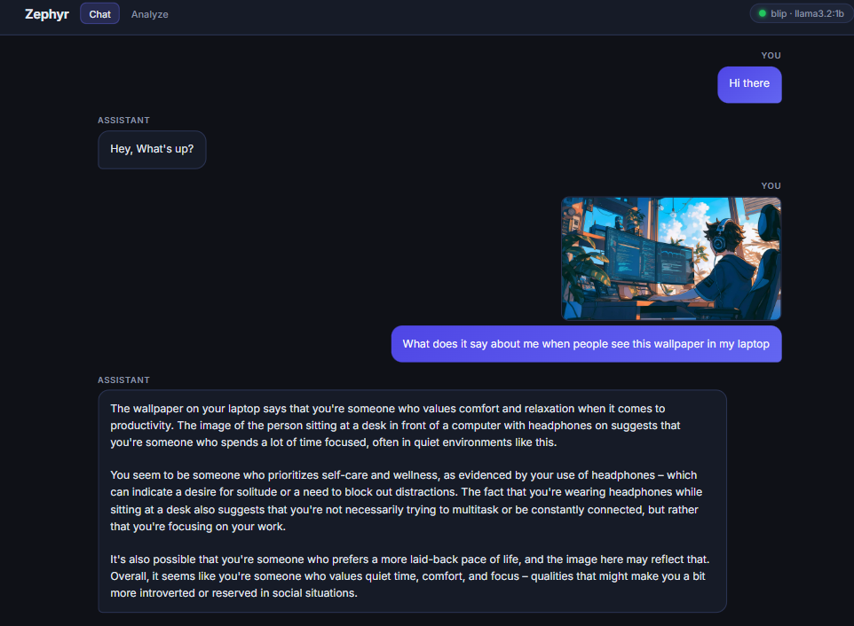

# ImageBot – AI Image-to-Text

Open-source multimodal pipeline: **CLIP/BLIP** for vision and **Ollama (LLaMA-family)** for language—image understanding and context-aware conversation without paid APIs.

A **FastAPI** app that turns images into text using a **vision model** (BLIP and/or CLIP) plus **Llama 3.2 (Ollama)** to polish the wording.

### Demo (prototype)

Chat UI with multimodal turns: text plus optional image upload, BLIP + Ollama in the status bar, streamed assistant replies.



**Why BLIP?** CLIP only scores a **fixed list** of short phrases (“a couple”, “a child”, …). Two children can wrongly rank as “a couple” because the list may not contain “two kids standing together”, and embeddings confuse “two people” with romantic pairs. **BLIP** is a **captioning** model: it generates an open sentence from pixels (e.g. “two young children standing side by side”)

---

## How it Works

Set `VISION_BACKEND` in `.env` (default **`blip`**):

| Mode | Vision | Use case |
|------|--------|----------|
| `blip` | [BLIP](https://huggingface.co/Salesforce/blip-image-captioning-base) caption only | Best general image → one sentence |
| `clip` | CLIP labels only | Legacy / tags only |
| `both` | BLIP + CLIP | Caption + optional tag chips (two models in RAM) |

```
User uploads image
      │
      ▼
   BLIP (default) ──► draft caption  ──┐
      │                                  │
   CLIP (optional) ─► tag scores        │
      │                                  ▼
      │                         Ollama llama3.2:1b
      │                         faithful rewrite
      ▼
 Streamed back to the browser (SSE)
```

**Other options** (not bundled here): **BLIP-2**, **InstructBLIP**, or multimodal LLMs (**LLaVA**, **Qwen-VL**) for richer captions at higher compute cost.

---

## Project Structure

```
imagebot/
├── main.py                 # FastAPI app: UI, static files, `/api/*` (JSON + SSE)
├── extensions.py           # Model singletons + run_vision()
├── services/               # Business logic used by the API
│   ├── chat_service.py
│   └── analyze_service.py
├── config.py               # Configuration
├── requirements.txt
├── .env.example
├── model/                  # BLIP, CLIP, Ollama chat/generate handlers
├── utils/
├── templates/              # chat.html, legacy.html
└── static/
    ├── js/api.js           # `IB.*` URL constants for the browser client
    ├── js/chat.js
    ├── js/main.js
    └── css/
```

The browser UI **only** calls `/api/*` (see `static/js/api.js`). **`GET /api`** or **`GET /api/`** returns a JSON catalog of endpoints.

---

## Prerequisites

| Tool | Version | Purpose |
|------|---------|---------|
| Python | ≥ 3.10 | Runtime |
| [Ollama](https://ollama.com) | latest | Local LLM server |
| CUDA (optional) | any | GPU acceleration for vision models |

First run downloads BLIP and/or CLIP weights from Hugging Face (see `VISION_BACKEND`).

---

## Setup

### 1. Clone & enter the project

```bash
git clone https://github.com/YOUR_USERNAME/imagebot.git
cd imagebot
```

### 2. Create & activate virtual environment

```bash
# Windows
python -m venv venv
venv\Scripts\activate

# macOS / Linux
python -m venv venv
source venv/bin/activate
```

### 3. Install dependencies

```bash
pip install -r requirements.txt
```

> **Note:** On first run, Hugging Face downloads vision weights (BLIP ~1GB; CLIP ~600MB if used).

### 4. Set up Ollama

```bash
# Install Ollama from https://ollama.com/download
# Then pull the model
ollama pull llama3.2:1b
```

### 5. Configure environment (optional)

```bash
cp .env.example .env
# Edit .env if you need custom values
```

### 6. Run the app

```bash
python app.py
```

Open **http://localhost:5000** in your browser.

---

## REST API

### `GET /api/status`
Returns service health and model info.

```json
{
  "status": "ok",
  "vision_backend": "blip",
  "blip_model": "Salesforce/blip-image-captioning-base",
  "clip_model": null,
  "ollama_available": true,
  "ollama_model": "llama3.2:1b"
}
```

---

### `POST /api/analyze`
Upload an image and receive the full result as JSON.

**Request** – `multipart/form-data`
| Field | Type | Description |
|-------|------|-------------|
| `image` | file | Image file (PNG, JPG, JPEG, GIF, WEBP, BMP) |

**Response**
```json
{
  "vision_backend": "blip",
  "blip_caption": "two young boys playing with toys on the floor",
  "clip_results": [],
  "description": "A warm indoor scene with two young boys playing with toys on the floor.",
  "elapsed_ms": 2350
}
```

With `VISION_BACKEND=clip` or `both`, `clip_results` contains label objects like `{ "label": "a dog", "confidence": 32.5 }`.

**curl example**
```bash
curl -X POST http://localhost:5000/api/analyze \
  -F "image=@/path/to/your/image.jpg"
```

---

### `POST /api/analyze/stream`
Same as above but streams the LLM response token-by-token using **Server-Sent Events (SSE)**.

**SSE Events**

| Event | Payload | Description |
|-------|---------|-------------|
| `blip` | `{"caption": "..."}` | BLIP draft caption (when backend uses BLIP) |
| `clip` | JSON array | CLIP results (when backend uses CLIP) |
| `token` | `{"token": "..."}` | LLM token |
| `done` | `{"elapsed_ms": N}` | Completion signal |
| `error` | `{"error": "..."}` | Error message |

---

## Tech Stack

- **[BLIP](https://arxiv.org/abs/2201.12086)** (`Salesforce/blip-image-captioning-base`) – image captioning
- **[OpenAI CLIP](https://github.com/openai/CLIP)** (optional) – zero-shot tag scores
- **[Ollama](https://ollama.com)** – local LLM inference
- **[Llama 3.2:1b](https://ollama.com/library/llama3.2)** – text refinement
- **[FastAPI](https://fastapi.tiangolo.com/)** + **[Uvicorn](https://www.uvicorn.org/)** – web framework and ASGI server
- **PyTorch** – model inference

---

## License

MIT
